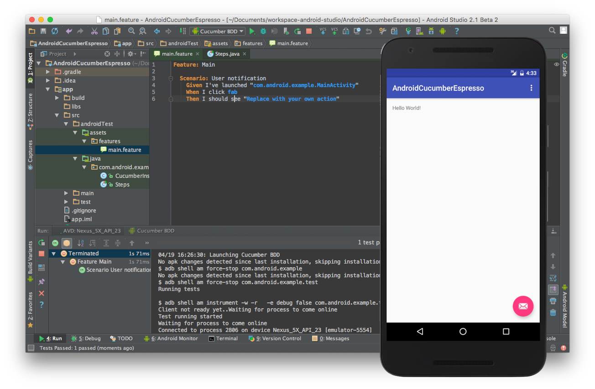

#android-cucumber-espresso
A template project to demonstrate the usage of Cucumber along with Espresso for acceptance testing on Android.

It was strongly inspired by the official example [1] but with one major difference:
`Activities` could be started with a dedicated step definition. This is important if you want to test multiple activities.



##Introduction
This talk [2] provides some basic introduction to the domain. It covers an overview of Cucumber, Gherkin, Features, Steps and Espresso.

##Setup
In order to incorporate Cucumber into your test routines a few adoptions has to be performed in your project setup:

* In your `build.gradle`
 - Specify a dedicated test application id (**Note:** This is mandatory, it won't work otherwise) and a custom `CucumberInstrumentationRunner`
```groovy
testApplicationId "com.android.example.test"
testInstrumentationRunner "com.android.example.test.CucumberInstrumentationRunner"
```
 - Add assets to your `sourceSets` so that Cucumber is able to find your features
```groovy
 sourceSets {
  androidTest { assets.srcDirs = ['src/androidTest/assets'] }
}
```
 - Add Cucumber dependencies (**Note:** There is [a bug](https://github.com/cucumber/cucumber-jvm/issues/893) which requires the following declaration)
```groovy
androidTestCompile('info.cukes:cucumber-android:1.2.4') {
  exclude module: 'cucumber-jvm-deps'
  exclude module: 'guava'
}
androidTestCompile 'info.cukes:cucumber-jvm-deps:1.0.3'
```

##References
1. https://github.com/cucumber/cucumber-jvm/tree/master/examples/android/android-studio/Cukeulator
2. https://speakerdeck.com/a11n/automated-acceptance-testing-with-cucumber-and-espresso
